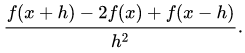
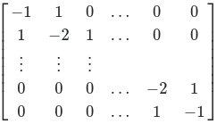
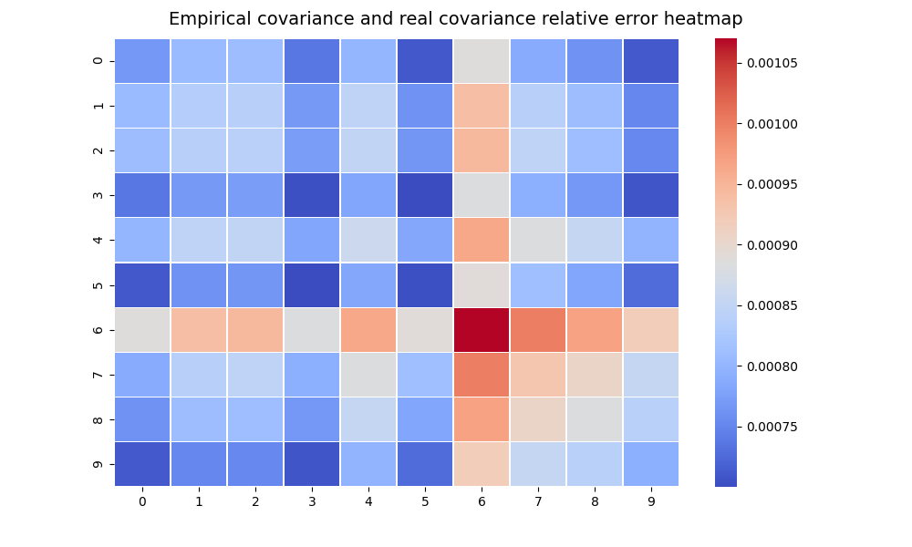

# fastgibbs
A python3 package which implements different sampling algorithms, including the chebyshev accelerated gibbs sampler, which converges faster than standard gibbs sampling algorithms.

# Installation:
TODO: make package available via pip.
</br>
For now, simply clone this package into the directory in which you store python packages on your local machine.
This can be found by executing the following command in a python shell:
```python3
>>> import site; site.getsitepackages()
['/usr/local/lib/python3.6/dist-packages', '/usr/lib/python3/dist-packages', '/usr/lib/python3.6/dist-packages']
```
One can then change to this directory in the terminal. I choose to use the local folder, so I am only installing the package for myself and not the other users on my computer:
```bash
cd /usr/local/lib/python3.6/dist-packages
```
We can then clone the repository
```bash
sudo git clone https://github.com/bencravens/fastgibbs
```
And the package should be installed.

# Example:
To use this package, you need two things. Firstly, you should have a precision matrix A which specifies a target distribution N you wish to sample from. The algorithms only support sampling from a distribution with mean zero so far. Secondly, you should pick one of the gibbs sampling algorithms you wish to use to sample from the distribution. The chebyshev accelerated polynomial one should be your default if you have a good idea about what relaxation parameter ω to use, otherwise the plain gibbs sampler is fine. 

To start with, import the algorithm you wish to use. I will use the chebyshev accelerated algorithm for this example. It is also useful to import all the standard scientific python packages, like numpy and others.

```python
#first import standard packages
import numpy as np
from matplotlib import pyplot as plt
import scipy

#now import chebyshev algorithm
from fastgibbs import gibbs_cheby
```

Now I will define the matrix A. Here I use the classic example of the discrete form of the negative laplacian operator. One example where this would be used is in electrostatics: if φ is some electrostatic potential associated with some charge distribution, then the charge distribution is proportional to the negative laplacian of φ. Here we use periodic boundary conditions. The second derivative can be described in discrete terms using the central finite difference scheme, and the following equation:
</br>
</br>

</br>
</br>
This is analogous to the laplacian filter used in image processing, or the continous laplacian operator used in vector calculus. On the boundaries, the periodicity means the (x-h) element cancels out with the (x) element, giving a -1 on the diagonal instead of a -2. This gives us the following matrix:
</br>
</br>

</br>
</br>
But this matrix is not invertible (i.e is singular), and the algorithm calls for positive, nonzero eigenvalues (or SPD matrices). A singular matrix has zero as an eigenvalue, so we add a small constant "α" on the main diagonal to make this matrix invertible. 
```python
#making example A
#set dimension of matrix
dims = 10
#set diagonal bump.. smaller is better
alpha = 1e-3
#make laplacian matrix
test_A = -0.5*scipy.ndimage.filters.laplace(np.eye(dims))
#add a bump along the diagonal
test_A += alpha*np.eye(dims)
#make covariance for illustrative purposes. This may not be computationally feasible for large matrices
real_cov = np.linalg.inv(test_A)
```
Now we have constructed our example matrix, we can take a look to see that it looks right.
```python
>>> print(test_A)
[[ 1.001 -1.     0.     0.     0.     0.     0.     0.     0.     0.   ]
 [-1.     2.001 -1.     0.     0.     0.     0.     0.     0.     0.   ]
 [ 0.    -1.     2.001 -1.     0.     0.     0.     0.     0.     0.   ]
 [ 0.     0.    -1.     2.001 -1.     0.     0.     0.     0.     0.   ]
 [ 0.     0.     0.    -1.     2.001 -1.     0.     0.     0.     0.   ]
 [ 0.     0.     0.     0.    -1.     2.001 -1.     0.     0.     0.   ]
 [ 0.     0.     0.     0.     0.    -1.     2.001 -1.     0.     0.   ]
 [ 0.     0.     0.     0.     0.     0.    -1.     2.001 -1.     0.   ]
 [ 0.     0.     0.     0.     0.     0.     0.    -1.     2.001 -1.   ]
 [ 0.     0.     0.     0.     0.     0.     0.     0.    -1.     1.001]]
```
Another useful thing to do would be to look at its condition number. A poorly conditioned matrix will take longer to solve and the solution will be less accurate. 
```python
>>> print(np.linalg.cond(test_A))
3901.1130325893664
```
So it is a very poorly conditioned problem. This is fine as the dimensionality of the matrix is low, it will still converge fast. Now to sample from a distribution with this as the precision matrix, we just have to create a chebyshev gibbs solver object, and use the sample method of this object. 

```python
my_gibbs = gibbs_cheby(1.0,test_A)
```

The first argument in gibbs_cheby objet is the relaxation parameter. This should be in the range (0,2) for the algorithm to converge, and the optimal value depends on the type of problem. For our problem, we have left it as 1.0. We then sample from the distribution using the sample method of the oject instance "my_gibbs", and then use the getter method "get_state" to retrieve our samples and the empirical covariance matrix of our set of samples. For an n dimensional state space, where we take k samples, the "state" vector that the get_state method returns will be of shape (k,n), where each row of the matrix is a sample, and each column corresponds to a variable of the state space. 

```python
my_gibbs.sample(int(5e4),40)
state,e_cov = my_gibbs.get_state()
print("relative error is {}".format(np.linalg.norm(real_cov-e_cov)/np.linalg.norm(real_cov)))
>>>converged at iter 35/40
relative error is 0.009908193517315386
```

Here the first argument of the "sample" method is the sample size, how many times you want to try from the distribution, and the second argument is k, the maximum number of times you wish to iterate to converge your samples to the target distribution. Because the matrix A is ill-conditioned, I picked a high k. The algorithm will finish once the relative error in the covariance of the target distribution is 1%, or if it reaches the maximum iteration. If you want to visualize which elements of the covariance matrix are converging faster/slower, you can use the plot function to visualize this.

```python
my_gibbs.plot()
```


</br>
</br>

# TODO: 
<ul>
  <li>Gitignore</li>
  <li>pip installable</li>
</ul>
